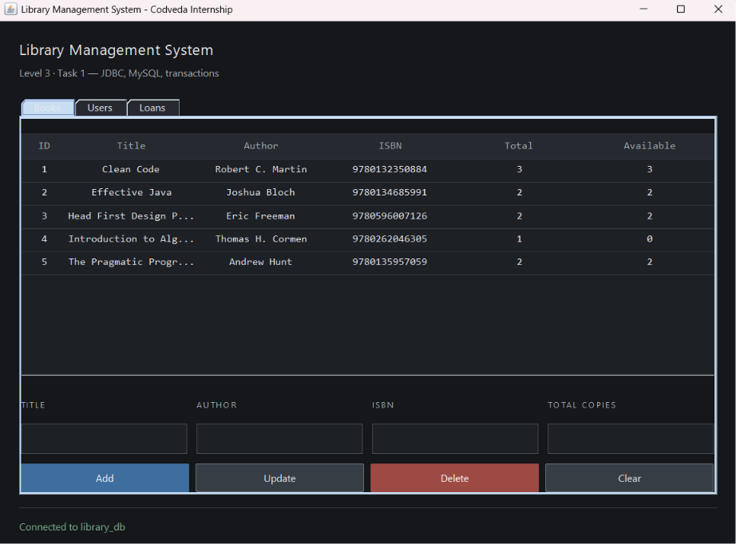
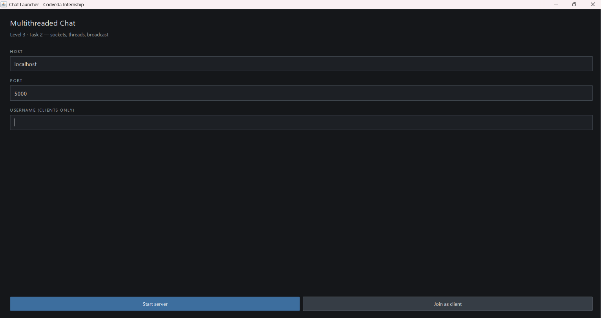
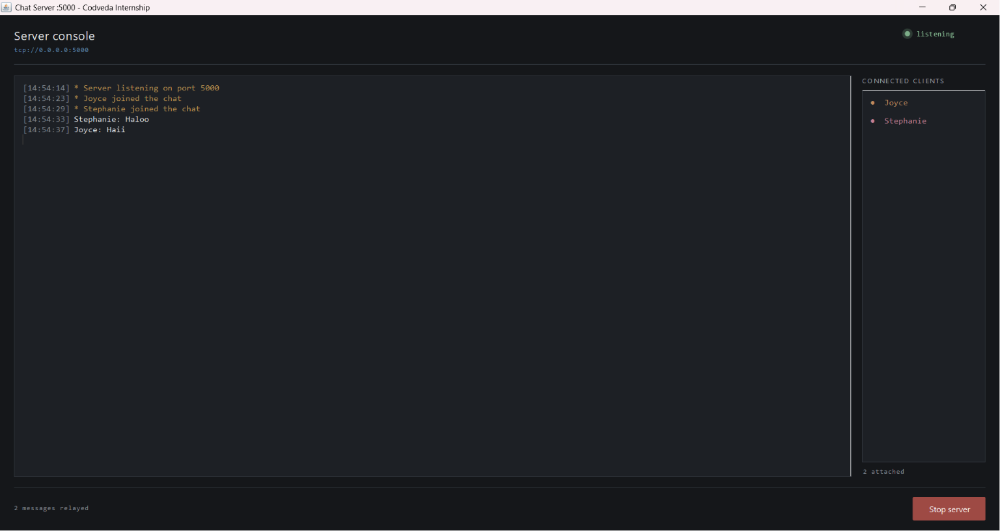
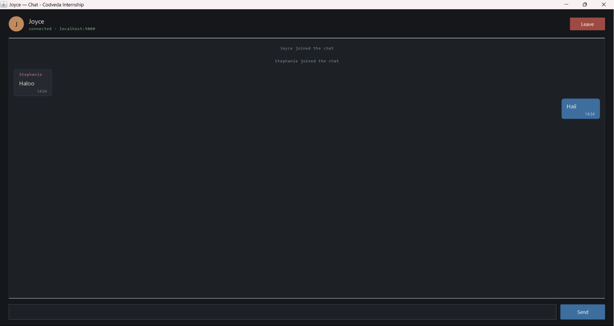

# Codveda Java Development Internship

This repository contains all tasks completed during the Java Development Internship at **Codveda Technology**. Each task is implemented as a standalone `.java` file and organized into folders based on its respective level.

> **Note:** Tasks are implemented as GUI desktop applications using Java Swing, rather than plain console applications, to make the projects more presentable for the LinkedIn showcase video required by the internship submission guidelines. All core objectives from the original task list (input handling, required logic, error/edge case handling) are still fully implemented.

## Completed Tasks

### Level 1 - Basic → [`Level1_Basic/`](./Level1_Basic)
- ✅ Task 1: [Basic Calculator](./Level1_Basic/Task1_BasicCalculator.java)
- ✅ Task 2: [Simple Number Guessing Game](./Level1_Basic/Task2_NumberGuessingGame.java)

### Level 2 - Intermediate → [`Level2_Intermediate/`](./Level2_Intermediate)
- ✅ Task 1: [Employee Management System](./Level2_Intermediate/Task1_EmployeeManagementSystem.java)
- ✅ Task 2: [Simple Number Guessing Game](./Level1_Basic/Task2_NumberGuessingGame.java)

### Level 3 - Advanced → [`Level3_Advanced/`](./Level3_Advanced)
- ✅ Task 1: [Library Management System with JDBC](./Level3_Advanced/Task1_LibraryManagementSystem.java)
- ✅ Task 2: [Multithreaded Chat Application](./Level3_Advanced/Task2_MultithreadedChat.java)

## Task Details

### Level 1 · Task 1 — Basic Calculator
A calculator with each arithmetic operation implemented as its own method (`add`, `subtract`, `multiply`, `divide`). Division by zero throws an `ArithmeticException` and puts the calculator into a recoverable error state.

### Level 1 · Task 2 — Simple Number Guessing Game
Generates a random number with Java's `Random` class, gives "too high" / "too low" feedback, limits the player to 7 attempts, and rejects non-numeric or out-of-range input.

### Level 2 · Task 1 — Employee Management System
Full CRUD over an in-memory `ArrayList<Employee>`, displayed in a `JTable`.

- **Create** — validates that name, position, and salary are present and that salary is a non-negative number, then assigns the smallest unused ID.
- **Read** — the table reloads from the list after every change.
- **Update** — edits the employee selected in the table.
- **Delete** — asks for confirmation before removing the record.

Employee data is encapsulated in an `Employee` class with private fields and getter/setter methods. A CSV export feature is included as an extra.

### Level 2 · Task 2 — File Handling
A text file analyzer that reads a file, processes its contents, and writes the result to a new file.

- **Read** — a `BufferedReader` over a `FileReader` streams the file line by line, so the whole file is never held in memory at once.
- **Process** — counts lines, words, characters (with and without spaces), unique words, the longest word, and the ten most frequent words.
- **Write** — a `PrintWriter` over a `FileWriter` saves a formatted report to a new file, with an overwrite confirmation if the target already exists.
- **Exceptions** — `FileNotFoundException` is caught separately from the broader `IOException`, and both reader and writer use try-with-resources.

A file can be chosen with the Browse dialog or typed by hand, which makes the `FileNotFoundException` path easy to demonstrate. A `sample.txt` file is included for testing.

### Level 3 · Task 1 — Library Management System with JDBC
A three-tab desktop application (Books, Users, Loans) backed by a MySQL database.

- **Database** — three tables in [`schema.sql`](./Level3_Advanced/schema.sql): `books`, `users`, and `transactions`. The `transactions` table links books to borrowers, with foreign keys to both.
- **CRUD** — books and users are created, read, updated, and deleted through `PreparedStatement` queries, never string concatenation, so input like `O'Reilly` is handled safely.
- **Transactions** — borrowing and returning each touch two tables, so both run inside a single database transaction: they commit together or roll back together. `SELECT ... FOR UPDATE` locks the book row so the same last copy cannot be borrowed twice.
- **Error handling** — a duplicate ISBN, a broken connection, and deleting a record with loan history each produce a clear, specific message instead of a raw stack trace.

Requires a running MySQL server and the MySQL Connector/J driver (bundled in the folder). See **How to Run** below.

### Level 3 · Task 2 — Multithreaded Chat Application
A chat server and client in one file, launched from a small menu so a single JVM can host the server and several clients side by side.

- **Sockets** — `ChatServer` owns a `ServerSocket`; `ChatClient` owns a `Socket`. They exchange newline-delimited UTF-8 text.
- **Threads** — the accept loop runs on its own thread, and every connected client is handled on a separate thread, so several people can chat at the same time.
- **Broadcast** — every message, join, and departure is sent to all connected clients. The client list is a `CopyOnWriteArrayList` so broadcasting is safe while clients connect and disconnect.
- **Design** — the server window is an operator console (colour-coded log, live client roster, message counter); the client window is a chat app (message bubbles, per-user colour, a Leave button).

## How to Run

Each file is a standalone GUI program with its own `main()` method.

```bash
# Navigate to the task's folder
cd Level2_Intermediate

# Compile
javac Task2_FileHandling.java

# Run
java Task2_FileHandling
```

Alternatively, open this project directly in **VS Code** with the **"Extension Pack for Java"** extension installed, then click Run above the `main()` method of the file you want to execute.

### Level 3 Task 1 — additional setup

This task needs a running MySQL server and the MySQL Connector/J driver.

```bash
# 1. Create the database (drops and recreates library_db)
mysql -u root -p < Level3_Advanced/schema.sql

# 2. Set DB_USER and DB_PASSWORD near the top of the .java file

# 3. Compile and run with the driver on the classpath
#    Windows Command Prompt:
javac -cp ".;mysql-connector-j-9.7.0.jar" Task1_LibraryManagementSystem.java
java  -cp ".;mysql-connector-j-9.7.0.jar" Task1_LibraryManagementSystem

#    PowerShell — wrap the classpath in single quotes:
#    javac -cp '.;mysql-connector-j-9.7.0.jar' Task1_LibraryManagementSystem.java
#    java  -cp '.;mysql-connector-j-9.7.0.jar' Task1_LibraryManagementSystem
```
### Level 3 Task 2 — trying the chat

```bash
cd Level3_Advanced
javac Task2_MultithreadedChat.java
java Task2_MultithreadedChat
```

Press **Start server** first, then return to the launcher, enter a username, and press **Join as client**. Repeat with a second username to see a message broadcast to every window at once.

## Features

#### Basic Calculator
- Addition
- Subtraction
- Multiplication
- Division
- Input validation
- Exception handling
- GUI built with Java Swing

#### Number Guessing Game
- Random number generation
- Seven-attempt limit
- Too High / Too Low hints
- Input validation
- Restart game feature
- Java Swing GUI

#### Employee Management System
- Create, Read, Update, Delete (CRUD)
- Data stored in an ArrayList
- Input validation
- Confirmation before delete
- CSV export
- Java Swing GUI with JTable

#### File Handling
- Reads a text file line by line
- Counts lines, words, and characters
- Finds unique words and word frequency
- Writes a formatted report to a new file
- Handles FileNotFoundException and IOException
- Java Swing GUI with file chooser

#### Library Management System (JDBC)
- MySQL database via JDBC
- CRUD for books and users
- Borrow and return with database transactions
- Row locking to prevent double-borrowing
- Clear error messages for constraint and connection failures
- Java Swing GUI with three tabs

#### Multithreaded Chat Application
- Client-server over Java Sockets
- One thread per connected client
- Real-time message broadcast
- Live client roster on the server
- Join / leave notifications
- Java Swing GUI

## Screenshots

### Basic Calculator


### Number Guessing Game


### Employee Management System


### File Handling


### Library Management System



### Multithreaded Chat Application



#### Server Console


#### Client Window



## Tech Stack

- Java (Swing for GUI, Sockets and threads for the chat)
- MySQL with JDBC (Level 3 Task 1)
- MySQL Connector/J — bundled in `Level3_Advanced/`
- Every other task runs with a standard JDK installation and no dependencies

## Author

**Joyce Stephanie Naibaho**

Java Development Intern — Codveda Technology

## Tags
`#CodvedaJourney` `#CodvedaExperience` `#FutureWithCodveda`