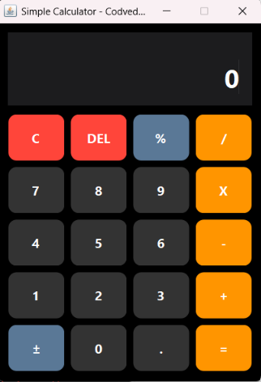
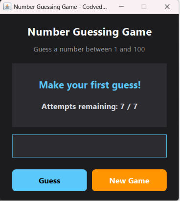

# Codveda Java Development Internship

This repository contains the tasks completed during the Java Development Internship at **Codveda Technology**.

The tasks are organized by internship level, with each task implemented as a standalone Java application.

> **Note:** Tasks are implemented as GUI desktop applications using Java Swing, rather than plain console applications, to make the projects more presentable for the LinkedIn showcase video required by the internship submission guidelines. All core objectives from the original task list (input handling, required logic, error/edge case handling) are still fully implemented.

## Completed Tasks

### Level 1 - Basic → [`Level1_Basic/`](./Level1_Basic)
- ✅ Task 1: [Basic Calculator](./Level1_Basic/Task1_BasicCalculator.java)
- ✅ Task 2: [Simple Number Guessing Game](./Level1_Basic/Task2_NumberGuessingGame.java)

### Level 2 - Intermediate → [`Level2_Intermediate/`](./Level2_Intermediate)
- Task 1: Employee Management System
- Task 2: File Handling - Reading and Writing to a File

### Level 3 - Advanced → [`Level3_Advanced/`](./Level3_Advanced)
- Task 1: Library Management System with JDBC
- Task 2: Multithreaded Chat Application

## Task Details

### Level 1 · Task 1 — Basic Calculator
A calculator with each arithmetic operation implemented as its own method (`add`, `subtract`, `multiply`, `divide`). Division by zero throws an `ArithmeticException` and puts the calculator into a recoverable error state.

### Level 1 · Task 2 — Simple Number Guessing Game
Generates a random number with Java's `Random` class, gives "too high" / "too low" feedback, limits the player to 7 attempts, and rejects non-numeric or out-of-range input.

## How to Run

Each file is a standalone GUI program with its own `main()` method.

```bash
# Navigate to the task's folder
cd Level1_Basic

# Compile
javac Task1_BasicCalculator.java

# Run
java Task1_BasicCalculator
```

Alternatively, open this project directly in **VS Code** with the **"Extension Pack for Java"** extension installed, then click Run above the `main()` method of the file you want to execute.

## Features

#### Basic Calculator
- Addition
- Subtraction
- Multiplication
- Division
- Input validation
- Exception handling
- GUI built with Java Swing

#### Number Guessing Game
- Random number generation
- Seven-attempt limit
- Too High / Too Low hints
- Input validation
- Restart game feature
- Java Swing GUI

## Screenshots

### Basic Calculator



### Number Guessing Game



## Tech Stack

- Java (Swing for GUI)
- No external dependencies — runs with a standard JDK installation

## Author

**Joyce Stephanie Naibaho**

Java Development Intern — Codveda Technology

## Tags
`#CodvedaJourney` `#CodvedaExperience` `#FutureWithCodveda`