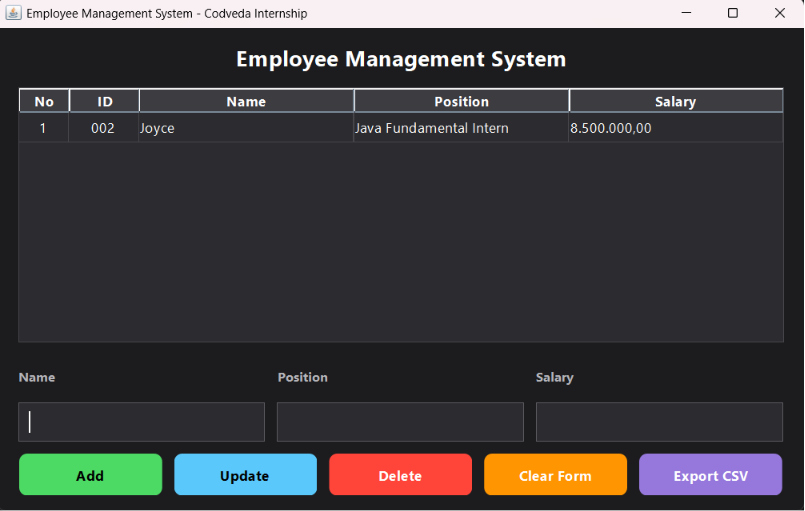
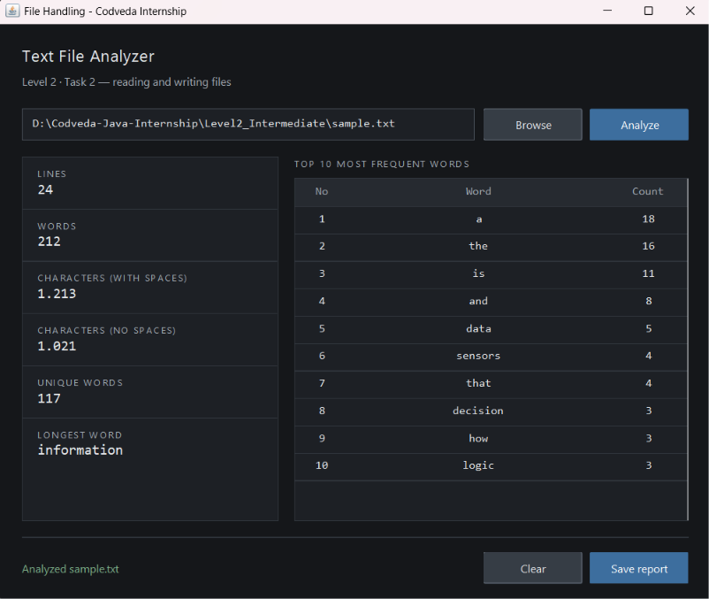

# Codveda Java Development Internship

This repository contains the tasks completed during the Java Development Internship at **Codveda Technology**.

As instructed, 2 out of 3 available tasks per level have been completed. Each task has its own `.java` file, grouped by level folder.

> **Note:** Tasks are implemented as GUI desktop applications using Java Swing, rather than plain console applications, to make the projects more presentable for the LinkedIn showcase video required by the internship submission guidelines. All core objectives from the original task list (input handling, required logic, error/edge case handling) are still fully implemented.

## Completed Tasks

### Level 1 - Basic → [`Level1_Basic/`](./Level1_Basic)
- ✅ Task 1: [Basic Calculator](./Level1_Basic/Task1_BasicCalculator.java)
- ✅ Task 2: [Simple Number Guessing Game](./Level1_Basic/Task2_NumberGuessingGame.java)

### Level 2 - Intermediate → [`Level2_Intermediate/`](./Level2_Intermediate)
- ✅ Task 1: [Employee Management System](./Level2_Intermediate/Task1_EmployeeManagementSystem.java)
- ✅ Task 2: [Simple Number Guessing Game](./Level1_Basic/Task2_NumberGuessingGame.java)

### Level 3 - Advanced → [`Level3_Advanced/`](./Level3_Advanced)
- Task 1: Library Management System with JDBC
- Task 2: Multithreaded Chat Application

## Task Details

### Level 1 · Task 1 — Basic Calculator
A calculator with each arithmetic operation implemented as its own method (`add`, `subtract`, `multiply`, `divide`). Division by zero throws an `ArithmeticException` and puts the calculator into a recoverable error state.

### Level 1 · Task 2 — Simple Number Guessing Game
Generates a random number with Java's `Random` class, gives "too high" / "too low" feedback, limits the player to 7 attempts, and rejects non-numeric or out-of-range input.

### Level 2 · Task 1 — Employee Management System
Full CRUD over an in-memory `ArrayList<Employee>`, displayed in a `JTable`.

- **Create** — validates that name, position, and salary are present and that salary is a non-negative number, then assigns the smallest unused ID.
- **Read** — the table reloads from the list after every change.
- **Update** — edits the employee selected in the table.
- **Delete** — asks for confirmation before removing the record.

Employee data is encapsulated in an `Employee` class with private fields and getter/setter methods. A CSV export feature is included as an extra.

### Level 2 · Task 2 — File Handling
A text file analyzer that reads a file, processes its contents, and writes the result to a new file.

- **Read** — a `BufferedReader` over a `FileReader` streams the file line by line, so the whole file is never held in memory at once.
- **Process** — counts lines, words, characters (with and without spaces), unique words, the longest word, and the ten most frequent words.
- **Write** — a `PrintWriter` over a `FileWriter` saves a formatted report to a new file, with an overwrite confirmation if the target already exists.
- **Exceptions** — `FileNotFoundException` is caught separately from the broader `IOException`, and both reader and writer use try-with-resources.

A file can be chosen with the Browse dialog or typed by hand, which makes the `FileNotFoundException` path easy to demonstrate. A `sample.txt` file is included for testing.

## How to Run

Each file is a standalone GUI program with its own `main()` method.

```bash
# Navigate to the task's folder
cd Level2_Intermediate

# Compile
javac Task2_FileHandling.java

# Run
java Task2_FileHandling
```

Alternatively, open this project directly in **VS Code** with the **"Extension Pack for Java"** extension installed, then click Run above the `main()` method of the file you want to execute.

## Features

#### Basic Calculator
- Addition
- Subtraction
- Multiplication
- Division
- Input validation
- Exception handling
- GUI built with Java Swing

#### Number Guessing Game
- Random number generation
- Seven-attempt limit
- Too High / Too Low hints
- Input validation
- Restart game feature
- Java Swing GUI

#### Employee Management System
- Create, Read, Update, Delete (CRUD)
- Data stored in an ArrayList
- Input validation
- Confirmation before delete
- CSV export
- Java Swing GUI with JTable

#### File Handling
- Reads a text file line by line
- Counts lines, words, and characters
- Finds unique words and word frequency
- Writes a formatted report to a new file
- Handles FileNotFoundException and IOException
- Java Swing GUI with file chooser

## Screenshots

### Basic Calculator


### Number Guessing Game


### Employee Management System



### File Handling



## Tech Stack

- Java (Swing for GUI)
- No external dependencies — runs with a standard JDK installation

## Author

**Joyce Stephanie Naibaho**

Java Development Intern — Codveda Technology

## Tags
`#CodvedaJourney` `#CodvedaExperience` `#FutureWithCodveda`